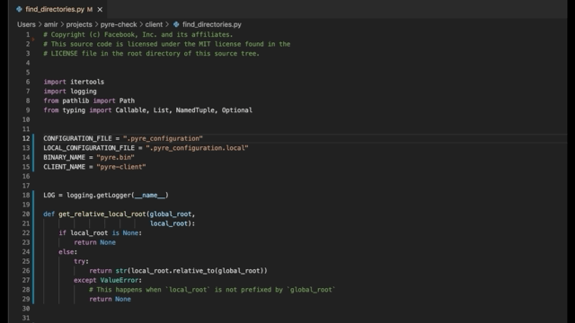

# VSCode Extension of Type4Py

This extension provides machine learning-based type autocompletion for Python, which assists developers to gradually add type annotations to their existing codebases.

- [Core Features](#core-features)
- [Usage](#usage)
  - [Quick Start](#quick-start)
  - [Step-by-Step](#step-by-step)
  - [Considerations](#considerations)
- [Installation](#installation)
- [Settings](#settings)
- [Privacy](#privacy)
- [Support](#support)
- [Development](#development)
- [Roadmap](#roadmap)
- [Contributors](#contributors)
- [Acknowledgements](#acknowledgements)

# Core Features
- **Machine learning**-based type prediction (powered by [Type4Py](https://github.com/saltudelft/type4py))
- Improved **autocompletion** for Python type annotations (based on [Python Type Hint](https://github.com/njqdev/vscode-python-typehint))
- Type autocompletion for **parameters** and **return types** of functions.
- Type autocompletion for module, class, and local **variables**.
- Simple, fairly fast and easy to use.

# Usage
## Quick Start

## Step-by-Step
1. In VSCode, select a Python source file of your interest.
2. Go to `View -> Command Palette -> Type4Py: Infer type annotations`.
3. Depending on the file size, after a couple of seconds, you will see a completion message on the bottom right of VSCode.
4. Now, you can start adding predicted type annotations to your code, similar to the [Quick Start](#quick-start) example above.

> **Note:** You can also enable automatic type inference when opening Python files. To do so, see [settings](#settings).

## Considerations
- Do not edit the selected source file after running the Type4Py extension. That is, add the relevant predicted types to the code, save the file and then edit as you wish. We will drop this consideration once the [caching solution](#roadmap) is implemented.
- Make sure that the selected source file does not have syntax or parse errors before running the extension. In VSCode, Python linters warn about such errors.
- Concerning variables' redeclaration, type predictions are available for the last redeclaration of variables. 

# Installation
> **NOTE:** Update VSCode before installing the extension.

The latest version of the extension can be installed from the [Visual Studio Marketplace](https://marketplace.visualstudio.com/items?itemName=saltud.type4py).

# Settings
| Name 	| Description 	| Default 	|
|---	|---	|---	|
| workspace.autoInferEnabled | If enabled, it automatically infers type annotations when opening a Python source file. Note that automatic inference works only once for a newly opened file. | false |
| workspace.filterPredictionsEnabled 	| If enabled, based on the file's imported names, irrelevent type predictions will be filtered out. Disable this setting if you would like to get all the predicted types regardless of relevancy. 	| true 	|
| workspace.shareAcceptedPredictions | If enabled, accepted type predictions will be shared with us for research purposes and improving our Type4Py model. Note that the value of VSCode Telemetry overrides this setting. Read our privacy statement [here](PRIVACY.md). | false

<!-- | workspace.typeCheckEnabled 	| **[NOT SUPPORTED YET!]** If enabled, type checking will be performed for predicted types. This will result in longer waiting times, but will lead to more precise type suggestions. | false 	| -->

# Privacy
Privacy is very prominent for us. You can read our privacy statements [here](PRIVACY.md).

<!-- # Limitations
To accommodate fair use and availability for all users, the extension has currently the following limitations:
- **Rate limit**: 5 requests per hour and 100 requests per day.
- **File size**: Python source files of up to 1K LoC can be processed. -->

<!-- # Known Issues -->

# Support
Issues and errors can be reported [here](https://github.com/saltudelft/type4py-vscode-ext/issues).

# Development
External contributions are welcome such as bug fixes and improvements! Feel free to send a pull request.
## Running the extension from source
1. Build the package & install dependencies using `npm install`
2. Compile the extension using `npm run compile`
3. Open `src/extension.ts` in VSCode, open *"Select Environment"*, and run in *"VS Code Extension Development"*
4. Open a Python source code file, open the Command Palette, and run the *"Type4Py: Infer type annotations"* command. 
5. After a success message pops up, fill function annotations as usual (e.g. `x:` or `def ...) ->`), and type completion items will show up (if available)

# Roadmap
Here are the desirable features for future releases.
- Implementing a caching solution to preserve type predictions when source files change.
- Enabling the type-checking process for the Type4Py's predictions using [mypy](https://github.com/python/mypy), preferably at the client-side.
- Fine-tuning the (pre-trained) Type4Py model on users' projects to learn project-specific types.

# Contributors
- Amir M. Mir (@mir-am)
- Evaldas Latoškinas (@elatoskinas)
- Sebastian Proksch (@proksch)
- Georgios Gousios (@gousiosg)

# Acknowledgements
The Type4Py model and its VSCode extension are designed and developed in [SERG](https://se.ewi.tudelft.nl/) at the Delft University of Technology.

